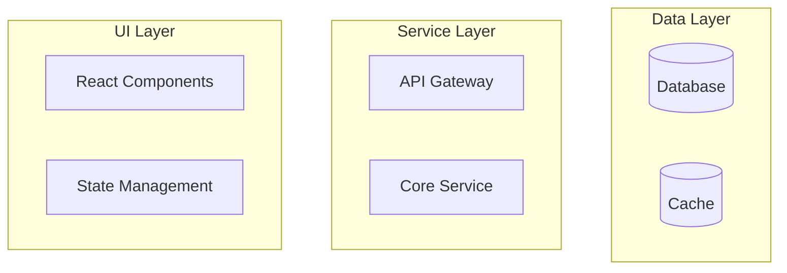
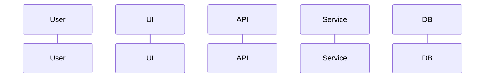

# Visualize Implementation

Creates a comprehensive HTML visualization of a feature or system implementation with interactive Mermaid diagrams and detailed documentation. The output is a standalone HTML file that can be opened directly in any browser without a server.

# Usage

- `/visualize-implementation` - Prompts for module/feature name and creates visualization
- `/visualize-implementation {{MODULE_NAME}}` - Creates visualization for specific module/feature
- `/visualize-implementation {{MODULE_NAME}} "{{DESCRIPTION}}"` - Creates visualization with custom context

# Examples

```bash
/visualize-implementation authentication
/visualize-implementation api/users "Focus on the REST endpoints and data flow"
/visualize-implementation state-manager "Show the state management architecture"
```

# Process

## 1. Gather Context

First, understand what needs to be visualized:
- **Identify the module/system** from the user's input
- **Determine scope** - is it a single module, multiple integrated components, or a system-wide view?
- **Check existing knowledge** - what's already in context vs what needs to be discovered

## 2. Research Implementation

If not already in context, gather necessary information:

### Documentation Research
- Read README files in the target module/feature
- Check for architecture documentation
- Look for design documentation explaining decisions
- Review API documentation if available
- Check test documentation for behavior understanding

### Code Research
- Identify main entry points and core files
- Check for route/endpoint definitions (if applicable)
- Review data models and types
- Identify service/business logic layers
- Check integration points with other modules
- Review configuration and dependencies

### Integration Research
- Check how the module integrates with other parts of the system
- Identify shared services or dependencies
- Look for data persistence patterns
- Review security and access patterns if applicable

## 3. Generate HTML Structure

Create a standalone HTML file in a documentation directory:

### File Location Strategy

**Store visualizations in Documentation/visualizations/ organized by date:**
- **Location**: `Documentation/visualizations/{YYYY-MM-DD}/`
- **Naming**: `{HH}_{NAME}_visualization.html`
- **Benefits**: Organized by date, chronological sorting, easy to find recent work

#### Examples:
```
Documentation/visualizations/2025-09-29/
├── 09_authentication_visualization.html
├── 14_api_architecture_visualization.html
└── 16_state_management_visualization.html

Documentation/visualizations/2025-09-30/
├── 10_database_schema_visualization.html
└── 15_deployment_pipeline_visualization.html
```

### Directory Creation
Create the dated directory if it doesn't exist before writing the file.

**File naming format:**
- Current hour (00-23) for chronological sorting
- Module/system name (lowercase with hyphens)
- Always ends with `_visualization.html`

### Required Sections

#### Header
- Feature name and purpose
- Brief description
- Tech stack badges

#### Architecture Overview (Mermaid Diagram)


#### File Structure (REQUIRED)
```
{MODULE_PATH}/
├── docs/              # Documentation if present
├── src/ or lib/       # Main source code
├── tests/             # Test files
├── types/             # Type definitions
├── config/            # Configuration
└── README.md          # Module overview
```

Adapt the structure visualization to match the actual project organization.

#### Implementation Flow (Mermaid Flowchart)
Show the request/response flow through the system

#### Data Flow (Mermaid Sequence Diagram)


#### API Endpoints
- List all endpoints with methods (GET, POST, PATCH, DELETE)
- Use color coding: GET=green, POST=blue, PATCH=orange, DELETE=red
- Show removed/deprecated endpoints as struck-through

### Recommended Sections

#### Key Design Decisions
- Architectural choices and rationale
- Trade-offs made
- Patterns employed
- Security considerations

#### Feature Capabilities
- Grid layout of features
- Icons and descriptions
- Permissions required

#### Technical Implementation
- Frontend tech stack
- Backend tech stack
- Database schema
- External integrations

#### Key Implementation Points
- Important patterns or conventions
- Non-obvious behaviors
- Performance optimizations
- Known limitations

#### Testing Checklist
- Unit test coverage
- Integration test scenarios
- E2E test flows
- Performance benchmarks

#### Future Enhancements (Optional)
- Planned improvements
- Technical debt items
- Scaling considerations
- Integration opportunities

## 4. HTML Template Structure

```html
<!DOCTYPE html>
<html lang="en">
<head>
    <meta charset="UTF-8">
    <meta name="viewport" content="width=device-width, initial-scale=1.0">
    <title>{{FEATURE}} - Implementation Visualization</title>
    <script src="https://cdn.jsdelivr.net/npm/mermaid@10/dist/mermaid.min.js"></script>
    <script>
        window.addEventListener('DOMContentLoaded', function() {
            mermaid.initialize({ 
                startOnLoad: true,
                theme: 'default',
                flowchart: {
                    useMaxWidth: true,
                    htmlLabels: true,
                    curve: 'basis'
                },
                securityLevel: 'loose'
            });
            mermaid.contentLoaded();
        });
    </script>
    <style>
        /* Professional gradient theme */
        body {
            background: linear-gradient(135deg, #667eea 0%, #764ba2 100%);
        }
        
        .container {
            max-width: 1400px;
            margin: 0 auto;
            background: white;
            border-radius: 20px;
            box-shadow: 0 20px 60px rgba(0,0,0,0.3);
        }
        
        /* Feature cards, badges, sections styling */
    </style>
</head>
<body>
    <!-- Content sections -->
</body>
</html>
```

## 5. Mermaid Diagram Guidelines

### Syntax Rules
- **No quotes in subgraph names** - Use: `subgraph Frontend` not `subgraph "Frontend"`
- **Avoid special characters** in node labels - No `<br/>`, `/`, or complex HTML
- **Use simple node IDs** - `API` not `API/Gateway`
- **Keep labels concise** - Long descriptions go in documentation, not diagrams

### Color Scheme
```mermaid
style NODE fill:#COLOR,color:#fff

Colors:
- #10b981 - Success/Creation (green)
- #3b82f6 - Information/View (blue)  
- #f59e0b - Warning/Update (orange)
- #ef4444 - Danger/Delete (red)
- #667eea - Primary (purple)
- #764ba2 - Secondary (deep purple)
- #6b7280 - Neutral (gray)
```

### Diagram Types
- **graph TB/LR** - Architecture overviews
- **flowchart LR/TB** - Process flows
- **sequenceDiagram** - Interaction sequences
- **erDiagram** - Database relationships (if applicable)
- **stateDiagram-v2** - State machines (for complex state management)

## 6. Content Guidelines

### Do Include
✓ **Actual implementation details** - What exists now, not plans
✓ **File paths and structure** - Help developers navigate
✓ **API contracts** - Endpoints, methods, payloads
✓ **Data flow** - How information moves through the system
✓ **Integration points** - How features connect
✓ **Key decisions** - Why things were built this way
✓ **Known issues** - Current limitations or bugs
✓ **Testing approach** - How to verify functionality

### Don't Include
✗ **Sensitive information** - No keys, secrets, or PII
✗ **Unnecessary code blocks** - Link to files instead
✗ **Historical changes** - Focus on current state
✗ **Personal opinions** - Stay objective and factual
✗ **Overwhelming detail** - Keep it visual and high-level

## 7. Validation

Before finalizing:
- ✓ HTML opens directly in browser (no server needed)
- ✓ All Mermaid diagrams render without errors
- ✓ File structure section is complete and accurate
- ✓ API endpoints are current and correctly colored
- ✓ No broken internal links or references
- ✓ Responsive design works on different screen sizes
- ✓ Content is factual and up-to-date

## Output

The command creates visualization files in a date-organized directory:

### File Location
- **Path**: `Documentation/visualizations/{YYYY-MM-DD}/{HH}_{NAME}_visualization.html`
- **Example**: `Documentation/visualizations/2025-09-29/14_authentication_visualization.html`

### File Organization Benefits
- **Temporal organization** - Easy to find today's and recent work
- **Chronological sorting** - Latest files appear at bottom within each day
- **Version controlled** - All visualizations can be tracked in git
- **Discoverable** - Consistent location and naming pattern
- **Shareable** - Standalone HTML files that open directly in browser

### Navigation
- **Today's work**: Check `Documentation/visualizations/{YYYY-MM-DD}/`
- **Recent work**: Browse recent date folders
- **Latest files**: Scroll to bottom of today's folder (highest hour number)
- **Historical**: Archive old date folders as needed

The visualization should tell the complete story of how a module/feature works, making it easy for developers to understand the implementation and discuss architectural decisions.